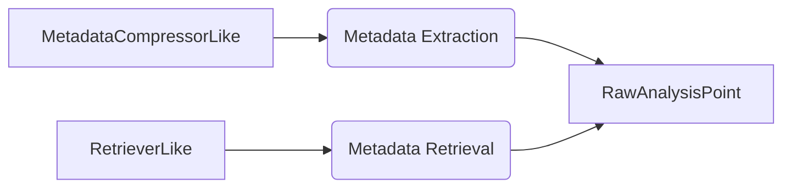
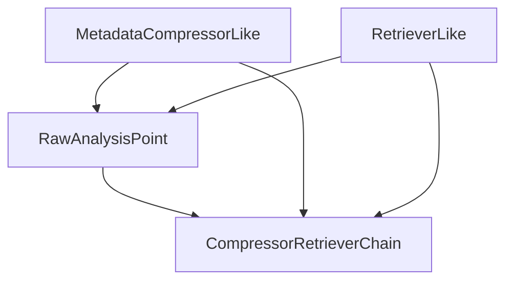

# AnalyticalRetrieverExample

## Module Overview

This module implements an analytical metadata compression and retrieval framework inspired by Python langchain retriever architecture. Through the dual-interface design of `MetadataCompressorLike` and `RetrieverLike`, it achieves responsibility separation between analytical structure metadata extraction and retrieval, providing foundational support for analysis point generation and context understanding.

## Core Interface Design

### MetadataCompressorLike

```java
public interface MetadataCompressorLike {
    List<Metadata> compress();
}
```

- **Core Responsibility**: Analytical Structure Metadata Compressor Interface
- **Key Features**:
  - Extracts structured metadata including `RawMeasure`(metrics), `RawDimension`(dimensions), and `FilterObject`(conditional filters)
  - Builds the foundational semantic layer for analysis retrieval
  - Supports traversal compression for `AnalysisGraph`/`AnalysisTree`
- **Design Pattern**: Implements `CompressorLike` pattern forming responsibility-separated architecture with `RetrieverLike`

### RetrieverLike

```java
public interface RetrieverLike {
    List<Metadata> retrieveRelevantMetadata(List<Metadata> metadataElements);
}
```

- **Core Responsibility**: Analytical Metadata Retriever Interface
- **Key Features**:
  - Standardized metadata access interface
  - Supports multiple retrieval strategy implementations
  - Provides context compression pipeline input
- **Extensibility**: Unified interface for local/distributed retrieval scenarios

## Architectural Design Principles

### Dual-Interface Separation Pattern



### Core Design Principles

1. **Responsibility Separation**:
   - `MetadataCompressorLike` focuses on structure compression
   - `RetrieverLike` specializes in retrieval strategy
2. **Composable Extensibility**:
   - Implements chainable invocation through `CompressorRetrieverChain`
   - Supports context-enhanced retrieval in `CompressorRetrieverChain`
3. **Pattern Reusability**:
   - Inherits langchain retriever architecture philosophy
   - Uses strategy pattern for polymorphic retrieval

## Implementation Guidelines

1. **Compressor Implementation**:
   - Recommended to inherit `AnalysisGraphCompressor` base class
   - Must ensure type safety during compression process
   ```java
   // Example implementation
   public class CustomCompressor extends AnalysisGraphCompressor {
       @Override
       public List<Metadata> compress() {
           // Implementation logic here
       }
   }
   ```

2. **Retriever Implementation**:
   - Must maintain metadata lineage relationships
   - Recommended to implement caching optimization mechanisms
   ```java
   // Example implementation
   public class CustomRetriever implements RetrieverLike {
       @Override
       public List<Metadata> retrieveRelevantMetadata(List<Metadata> metadataElements) {
           // Implementation logic with caching here
       }
   }
   ```

3. **Combined Usage Pattern**:
   ```java
   // Typical composition example
   MetadataCompressorLike compressor = new AnalysisGraphCompressor();
   RetrieverLike retriever = new AnalysisRetriever();
   
   List<Metadata> compressed = compressor.compress();
   List<Metadata> retrieved = retriever.retrieveRelevantMetadata(compressed);
   ```

## Module Relationships



This design establishes an extensible analysis retrieval framework through interface abstraction and responsibility separation. It ensures foundational functionality simplicity while providing ample extension space for customized implementations in complex scenarios.

## Quick Start Guide

1. **Create Local Configuration**  
   Create [bootstrap-local.properties](file:///home/lmq/projects/notes_examples/templates/src/java/spring_mvcweb_analytical_retriever_module/src/main/resources/bootstrap-local.properties) with Nacos configuration:
   ```
   server.port=${SERVER_PORT:1888}

   app.cloud.nacos.server-addr=${NACOS_HOST:192.168.100.1}:8848
   app.cloud.nacos.username=${NACOS_USERNAME:nacos}
   app.cloud.nacos.password=${NACOS_PASSWORD:nacos}
   app.cloud.nacos.namespace=${NACOS_NAMESPACE:public}
   app.cloud.nacos.group=${NACOS_GROUP:DEFAULT_GROUP}
   ```

   **File Location Example**  
   ```
   src/main/resources/bootstrap-local.properties
   ```

2. **API Documentation**  
   Access Swagger UI at:  
   `http://localhost:1888/doc.html`

3. **Service Execution**  
   Start the Spring Boot application using:
   ```bash
   mvn spring-boot:run
   # or with custom port
   mvn spring-boot:run -Dspring-boot.run.arguments="--SERVER_PORT=8080"
   ```

4. **Dependency Requirements**  
   Ensure the following Spring Cloud components are available:
   - Spring Boot 2.7+
   - Spring Cloud 2021+
   - Nacos Configuration Center
   - OpenFeign (for service communication)

This framework provides a robust foundation for building analytical metadata processing pipelines in Spring-based microservice architectures, combining the flexibility of langchain's retriever patterns with enterprise-grade Java implementation patterns.
