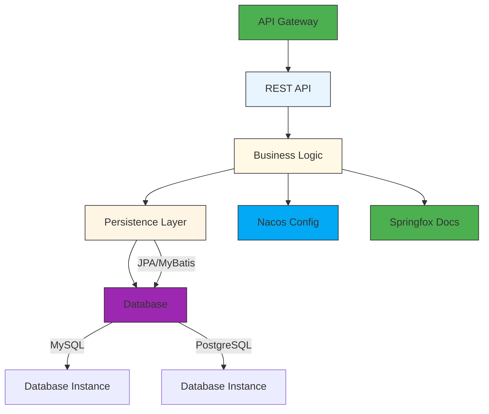

# Spring Cloud Microservice Template

A production-ready Spring Cloud microservice template with modular architecture, supporting pluggable persistence layers (JPA/MyBatis) and multi-database configurations.

## 📁 Project Structure

```
.
├── api                                       # REST API Layer
│   └── src
│       └── main
│           └── java
│               └── com
│                   └── drash
│                       └── example
│                           ├── controller    # REST Controllers
│                           └── dto           # API Data Transfer Objects
├── bootstrap                                 # Application Entry & Configuration
│   └── src
│       └── main
│           ├── java                          # Application.java + Swagger Config
│           └── resources                     # Configuration files (MySQL/PostgreSQL/Nacos)
├── business                                  # Business Logic Layer
│   └── src
│       └── main
│           └── java
│               └── com
│                   └── example
│                       ├── dto               # Internal Data Transfer Objects
│                       ├── mapper            # DTO Mappers
│                       └── service           # Service Implementations
├── jpa                                       # JPA Persistence Layer (Pluggable)
│   └── src
│       └── main
│           └── java
│               └── com
│                   └── example
│                       ├── entity            # Domain Entities
│                       └── repository        # JPA Repositories
```

## 🛠️ Technology Stack

- **Framework**: Spring Boot 3.x + Spring Cloud 2023.x
- **Configuration**: Nacos 2.x (Dynamic Configuration Management)
- **Documentation**: Springfox Swagger2 (API Documentation)
- **Build Tool**: Gradle 8.x
- **Persistence**: Pluggable Architecture (JPA/MyBatis)
- **Databases**: MySQL 8.x & PostgreSQL 15.x (Multi-datasource support)

## 🌟 Key Features

1. **Modular Architecture**: Clear separation of concerns between layers
2. **Pluggable Persistence**: 
   - Easily switch between JPA and MyBatis implementations
   - Database-agnostic repository interface design
3. **Multi-Database Support**: 
   - Run with MySQL or PostgreSQL via configuration
   - Dynamic datasource routing
4. **Ready-Made Functionality**:
   - Profile Management (CRUD Operations)
   - License Management (CRUD Operations)
5. **Cloud-Native Integration**:
   - Nacos for configuration management
   - Springfox for API documentation

## 🚀 Getting Started

### Prerequisites

1. Java 17
2. Gradle 8.x
3. MySQL 8.x / PostgreSQL 15.x
4. Nacos Server 2.x

### Installation

```bash
# Clone repository
git clone https://github.com/drawmoon/notes_examples.git

# Start Nacos (requires Docker)
docker run -d -p 8848:8848 -p 9555:9555 nacos/nacos-server

# Configure database credentials in:
bootstrap/src/main/resources/bootstrap-{mysql|postgres}.properties

# Build and run
./gradlew bootRun
```

### API Examples

**Profile Endpoint**:

```bash
GET /api/profiles HTTP/1.1
Host: localhost:8080
Accept: application/json

HTTP/1.1 200 OK
Content-Type: application/json

[
  {
    "id": 1,
    "name": "John Doe",
    "email": "john@example.com"
  }
]
```

## 🏗️ Architecture Design



## 📝 Contributing

1. Fork the repository
2. Create your feature branch (`git checkout -b feature/new-feature`)
3. Commit your changes (`git commit -am 'Add new feature'`)
4. Push to the branch (`git push origin feature/new-feature`)
5. Create a new Pull Request

## 📄 License

This project is licensed under the MIT License - see the [LICENSE](LICENSE) file for details
